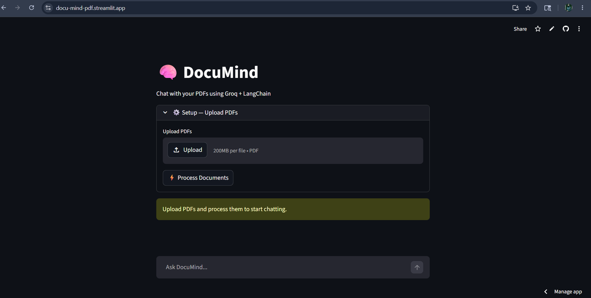
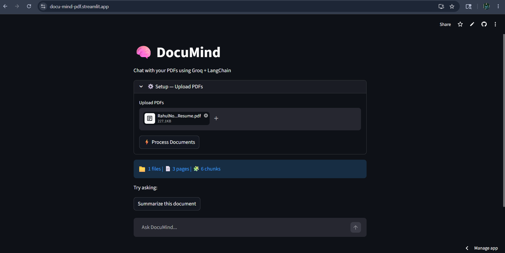
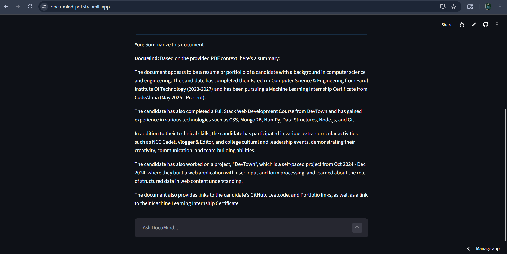

# DocuMind – AI PDF Chatbot

DocuMind is an AI-powered PDF chatbot that allows users to upload PDF documents and interact with them using natural language questions.

The application uses Retrieval-Augmented Generation (RAG) to provide context-aware answers from uploaded documents.

---
## Live Demo

[Launch DocuMind](https://docu-mind-pdf.streamlit.app/)

## Features

- Upload and analyze PDF files
- Ask questions from uploaded documents
- Context-aware AI responses
- Fast semantic search using vector embeddings
- Clean and interactive Streamlit interface

---
## Screenshots

### Home Page


### PDF Upload


### AI Chatbot Response

---
## Tech Stack

- Python
- Streamlit
- LangChain
- FAISS
- Groq API
- PyPDF2

---

## Installation

Clone the repository:

```bash
git clone https://github.com/rahulnongmeikapam/DocuMind
```

Install dependencies:

```bash
pip install -r requirements.txt
```

Run the application:

```bash
streamlit run app.py
```

---

## Usage

1. Upload a PDF document
2. Ask questions related to the document
3. Receive AI-generated answers instantly

---


---

## Future Improvements

- Multi-document support
- Chat history
- Authentication system
- Better UI/UX
- Export conversations

---

## Author

Rahul Nongmeikapam
